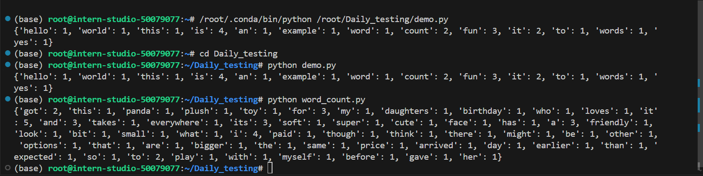

# Python基础知识

官网地址：[书生·浦语官网](https://internlm.intern-ai.org.cn/)    

InternLM-Github地址：[InternLM](https://github.com/InternLM)  

# 一、笔记

## 1.基础篇

首先我们先来了解python相关的基础知识，主要是以下四个内容：

> - Python(Miniconda)的安装
> - Python基础语法
> - Numpy基础(选修)
> - vscode 远程连接 internstudio开发机打断点调试 python 程序

### Python(Miniconda)的安装

miniconda和conda都是一个开源的软件包管理系统，主要安装多个版本的软件包和依赖关系，并且可以轻松切换。miniconda更具轻量级，安装速度更快，占用空间更少，它只包含Conda包和Python解释器，没有预装科学计算包。

**常用命令**

> - `conda list`：列出当前conda环境所链接的软件包。
> - `conda create`：创建一个新的conda环境。例如，`conda create -n myenv python=3.8`会创建一个名为myenv的新环境，并指定Python版本为3.8。
> - `conda activate`：激活一个已存在的conda环境。
> - `conda deactivate`：退出当前激活的环境。
> - `conda install`：在当前激活的环境中安装包。
> - `conda update`：更新包或conda本身到最新版本。
> - `conda remove`：从当前环境中卸载包。
> - `conda env list`：显示所有已创建的环境。

  **Conda**不仅为**Python**程序创建，也可以打包和分发其他软件，并且支持多种编程语言，包括**Python、R、Ruby、Lua、Scala、Java、JavaScript、C/C++**等。它被广泛用于数据分析、科学计算和机器学习领域，提供了简单而强大的工具来创建、部署和维护这些领域所需的环境。总的来说，Conda是一个在数据分析和软件开发领域非常有用的工具，特别是当需要管理多个项目和不同版本的依赖时，Conda可以大大简化环境和依赖管理的复杂性。

#### 下载miniconda

​    miniconda和anaconda都可以通过官网下载，也可以去清华源下载。

​        清华源miniconda下载链接: [Index of /anaconda/miniconda/ | 清华大学开源软件镜像站 | Tsinghua Open Source Mirror](https://mirrors.tuna.tsinghua.edu.cn/anaconda/miniconda/)(建议选择python3.9以上的版本，比如Miniconda3-py310_24.5.0)

windows可以通过图形化的安装程序直接完成安装记得在最后一步把miniconda加入环境变量，python的包管理pip与conda的源服务器均在境外，安装包的时候常常会碰到下载慢的情况。这时我们可以把pip与conda的源替换为国内的镜像，下面我们将刚刚安装好的环境替换为清华源。我们需要进入命令行开始进行换源，Windows可以直接打开miniconda powershell promt，首先将pip替换为清华源，只需要一条命令。

 `pip config set global.index-url https://pypi.tuna.tsinghua.edu.cn/simple`

给conda替换成清华源。各系统都可以通过修改用户目录下的 `.condarc` 文件来修改镜像源。Windows 用户无法直接创建名为 `.condarc` 的文件，可先执行 `conda config --set show_channel_urls yes` 生成该文件之后再修改。在用户目录找到`.condarc` 文件后，使用文本编辑器打开，将下面的内容复制进去并保存。

```Shell
 channels:   - defaults show_channel_urls: true default_channels:   
 - https://mirrors.tuna.tsinghua.edu.cn/anaconda/pkgs/main   
 - https://mirrors.tuna.tsinghua.edu.cn/anaconda/pkgs/r   
 - https://mirrors.tuna.tsinghua.edu.cn/anaconda/pkgs/msys2 custom_channels:   
 conda-forge: https://mirrors.tuna.tsinghua.edu.cn/anaconda/cloud   
 msys2: https://mirrors.tuna.tsinghua.edu.cn/anaconda/cloud   
 bioconda: https://mirrors.tuna.tsinghua.edu.cn/anaconda/cloud   
 menpo: https://mirrors.tuna.tsinghua.edu.cn/anaconda/cloud   
 pytorch: https://mirrors.tuna.tsinghua.edu.cn/anaconda/cloud   
 pytorch-lts: https://mirrors.tuna.tsinghua.edu.cn/anaconda/cloud   
 simpleitk: https://mirrors.tuna.tsinghua.edu.cn/anaconda/cloud   
 deepmodeling: https://mirrors.tuna.tsinghua.edu.cn/anaconda/cloud/
```

 

接着在命令行中运行 `conda clean -i` 清除索引缓存，保证用的是镜像站提供的索引。

#### 创建一个python联系的Conda虚拟环境

```python
conda create -n python-tutorial python=3.10 
conda activate python-tutorial  
pip install jupyter lab 
pip install numpy
```


激活环境和启动Jupyter

```python
conda activate python-tutorial         
jupyter lab         
```


#### 使用Vscode连接开发机然后进行python debug

VScode下载地址：[Visual Studio Code - Code Editing. Redefined](https://code.visualstudio.com/)

VSCode是由微软开发一款轻量级但功能强大的代码编辑器，开源且完全免费。它拥有丰富的插件生态系统、跨平台支持、以及内置的Git控制功能，为开发者提供了高效便捷的编码体验。

debug就是代码执行不按预期运行，可以在程序中设置断点一行一行的运行代码，观察程序中变量传值的变化，找出错误并修改。

打开Vscode后，有个插件图标，点开后，输入“Remote-SSH”，安装这个插件，然后进入remote explorer（就是插件图片下面一个图标），在ssh目录下创建一个ssh连接，用来连接开发机的，这里过程有任何疑问直接私我吧。


然后就是跟着步骤一步一步执行，本地c盘配置文件（`C:\\User\xxx\.ssh\config`），然后就是去复制开发机的"SSH连接"的命令和密码，开发机类型选择linux即可。

然后记得安装下python debug调试插件，后面会用到的，然后就是你安装后的vscode上方打开-新建终端（Terminal终端）。

这里还有一个小技巧就是在**vscode使用命令行进行debug**，vscode也支持通过remote的方法连接我们在命令行中发起的debug server。首先我们要配置一下debug的config。
还是点击VSCode侧边栏的“Run and Debug”（运行和调试)，单击"create a lauch.json file"，选择debugger时选择python debuger。选择debug config时选择remote attach就行，随后会让我们选择debug server的地址，因为我们是在本地debug，所以全都保持默认直接回车就可以了，也就是我们的server地址为localhost:5678。

#### debug命令行

现在vscode已经准备就绪，让我们来看看如何在命令行中发起debug。如果没有安装debugpy的话可以先通过pip install debugpy安装一下。

```python
pip install debugpy
python -m debugpy --listen 5678 --wait-for-client ./myscript.py
```

然后就是在脚本代码中设置断点了，左边我们在”VARIABLES“变量中看到我们设置断点的地方变量的值的变化，这里也可以简化一下命令，在linux系统中，可以对 *~/.bashrc* 文件中添加以下命令

```Plain
alias pyd='python -m debugpy --wait-for-client --listen 5678'
```

然后执行

```Plain
source ~/.bashrc
```

这样之后使用 pyd 命令(你可以自己命名) 替代 python 就能在命令行中起debug了，之前的debug命令就变成了

```Shell
pyd ./myscript.py
```

windows可以在powershell中操作，这里就不详细说明了，具体请参考训练营提供的教程。

这里开始直接完成作业了，其实在本地idea（Pycharm或Vscode工具连接开发机）写一个wordcount.py即可，作业主要目的也是为了让同学们熟悉Python工具和插件的使用。

这里我直接附上wordcounty.py的代码：

```python
import string


def wordcount(text):
    # 替换掉文本中的标点符号（用translate方法更加高效率一点，一次性地移除所有指定的字符）
    translator = str.maketrans('', '', string.punctuation)
    text = text.translate(translator)
    # # for循环将标点符号逐个替换为空格，效率较低
    # for char in string.punctuation:
    #     text = text.replace(char, ' ')
    # 将单词转换成小写，并分割成单词列表
    words = text.lower().split()
    # 创建一个字典来统计单词频率，保持文本中的顺序
    word_counts = {}
    for word in words:
        if word in word_counts:
            word_counts[word] += 1
        else:
            word_counts[word] = 1

    return word_counts


# 测试函数
input_text = """
Hello world!  
This is an example.  
Word count is fun.  
Is it fun to count words?  
Yes, it is fun!
"""
print(wordcount(input_text))
```


代码中包含详细的注释，这里就不详细解释代码了哈😀，结果如下（一个是vscode连接开发机的结果截图；一个是本地Pycharm执行的结果截图）：




第二个作业就是在本地vscode连接远程开发机，将写的wordcount函数在开发机上进行debug，体验debug的全流程，并完成一份debug笔记。


这里我们介绍下 debug面板各按钮功能介绍：

  1: continue: 继续运行到下一个断点

  2: step over：跳过，可以理解为运行当前行代码，不进入具体的函数或者方法。

  3: step into: 进入函数或者方法。如果当行代码存在函数或者方法时，进入代码该函数或者方法。如果当行代码没有函数或者方法，则等价于step over。

  4: step out：退出函数或者方法, 返回上一层。

  5: restart：重新启动debug

  6：**修复错误并重新运行**： 如果你找到了代码中的错误，可以修复它，然后重新运行debug来确保问题已经被解决。


#### 笔记😀😀：

简单介绍下我打印的断点，我打印了几乎每一行代码，首先就是`translator`这里就是打印出我要删除的标点符号的Unicode码点，这个建议可以自行去了解下，不作详细介绍了。

- 每个数字代表一个标点符号的`Unicode`码点。
- `None`表示对应的字符将被删除

然后就是word和word_counts,顾名思义就是打印分割转换后的单词和单词字典了。这里把每一行代码都详细解释和debug了，可以看到text内容在代码里面的每一步传值和流程了，方便我们熟悉代码逻辑和改进错误。

# 二、总结

​       这节课知识点重点在Python工具和插件的使用，整个流程也比较简单，希望同学们在学习大模型，尤其是算法优化，模型蒸馏，量化，剪枝脚本上面有不理解的多多尝试debug一下，加深理解，最后祝每一位同学都熟练掌握“炼丹”技术😀😀😀。